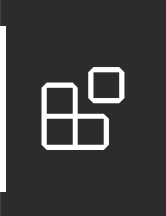

# Installation

## Dependencies

To run Forge, you will need to have installed:

- [Racket](https://download.racket-lang.org/all-versions.html) (we suggest the latest version, and certainly no lower than 8.7);
- Java 11 or later (which you can get [here](https://www.oracle.com/java/technologies/javase-downloads.html) if you don't have it); 
- A modern web-browser for visualizing output (we suggest, and primarily test on, Firefox).

We strongly suggest using our VSCode extension to write Forge, although you can also run from the terminal or use DrRacket (Racket's built-in IDE). You can get VSCode [here](https://code.visualstudio.com).

## Installing Forge

To install Forge, you have two options. The first is to **install from Racket’s package server**, and the second is to **install from Git**, which also allows (but doesn't require) you to use the latest development build if you wish.

We recommend installing from Git, because this way you can pull updates immediately if you wish to. 

### Installing from Git 

To install via Git, open a terminal window. Then: 

- clone our Git repository (`git clone https://github.com/tnelson/forge`);
- change directory to the repository folder (`cd forge`);
- install the `forge` and `froglet` packages (`raco pkg install ./forge`).

If you wish to switch to the development branch, you must:
- check out the development branch (`git checkout dev`);
- rebuild Forge (`raco setup forge`).

~~~admonish warning title="Using ./"
Note the `./` in the `install` command! If you write `raco pkg install forge froglet`, that will install both from the package server instead of your local directory. Adding prefix `./` tells `raco` that you're talking about folders instead. It's also important to have both `./forge` and `./froglet` in the single command; they depend on each other, so leaving one out will cause `raco` to "helpfully" install it from the package server, not your local drive.
~~~

~~~admonish note title="Upgrading a version from before 2025?"
If you have already installed a version of Forge prior to 2025, we are no longer using the separate package `froglet`. Rather than simply updating, you should run `raco pkg uninstall forge froglet` and follow the installation instructions from the beginning.
~~~

### Installing from Racket's Package Servers

For the standard package-server installation, after installing Racket, run `raco pkg install forge froglet` from your command line. Alternatively, you can run Racket's IDE, DrRacket, and navigate to _File > Install Package_. Type `forge` as the package name and choose **Install**, then do the same for `froglet` 

If the package is already installed, you'll see an **Update** button instead of an **Install** button.

#### Forge Version

When you run a Forge file (via `racket <filename>` at the command line), you'll be told the _Forge version_ you're running. This is important information to include with questions, etc. If you're taking a class that uses Forge, you can expect a few Forge updates throughout the semester---*please keep Forge updated!*

## Installing VSCode Extension for Forge

To get Forge's VSCode extension, open VSCode and click the Extensions button on the sidebar: 

Then type `forge-language-server` in the search bar. You should see an extension with that title, under the developer name "Siddhartha Prasad". Install it and reload VSCode.

~~~admonish warning title="For early adopters" 
An early version of this extension was provided via Github, rather than the VSCode Marketplace. Please **use the Marketplace version** (and uninstall the other, if you have it) if for no other reason than it will automatically update when you restart VSCode.
~~~

### Logging in VSCode

If you're working in a file with the `.frg` extension, you should see an eye icon in your VSCode toolbar (usually on the upper right). This can be used to opt out of (and back into) logging. By default, we log the state of your Forge model whenever you click the run button in VSCode. This includes the contents of every `.frg` file being edited in VSCode. No other information is recorded, not even your identity. 

~~~admonish note title="Comparison to Spring 2023"
In prior years, logging was done via annotations to `#lang` in homework files. We no longer do this. A major consequence is that we no longer know your identity from logs; we believe this is an improvement! However, it does mean we can't reach out if we see a problem happening. Please _report problems_ if you see them. 
~~~

We log primarily for two reasons. 
* First, Forge is under active development---the majority of the codebase was written by undergraduate researchers working with Tim! This means that information about how Forge is used, what errors arise, etc. can be useful in making Forge better. 
* Second, Forge is mainly used in the classroom. It's easy for instructors to claim, anecdotally, that students "like" something or "find it useful" based on a handful of office-hours conversations. We want to hold ourselves to a higher standard. What proportion of students _actually uses_ that feature? Is the hinting we provide on some problems _effective_? Questions like these are impossible to answer without knowing something about patterns of use. 

<!-- ## Installing VSCode Extension for GPT-3

This extension allows you to write questions to GPT-3 from your editor. 

---
### Requirements

- Your Brown Provided API Key.
- Your Brown-provided User Id.

--- 

[Once downloaded, the extension can be installed following the instructions here.](https://code.visualstudio.com/docs/editor/extension-marketplace#_install-from-a-vsix)

When the extension is installed, a prompt will appear for you to enter in your API key and your User Id. You must use the extension **only with the API key provided by the course**, obtained from filling out the [responsible-use form](https://docs.google.com/forms/d/e/1FAIpQLSe18e5qNnaZm6JBMsAM3cNJiEC43ElsLyL6IJIN6U3WDOR1-w/viewform?usp=sf_link).

---

### Functionality
#### Ask GPT
Sends user input to GPT for processing. The response will appear in a modal.

> Default key binding set to `alt + g` (Windows) or `cmd + g` (Mac)
> Ask GPT in the Status Bar

#### Ask GPT inline
Queries GPT-3 with highlighted text. The response is automatically injected **below** the highlighted docs.

> Default key binding set to `alt + q` (Windows) or `cmd + q` (Mac)

#### Re-enter API Key

> - Open command palette and run `Update OpenAI API Key` (alt + m on Windows, cmd + m on Mac)
> - Enter your correct API Key into the prompt 
> - Reload VSCODE

#### Re-enter UserId

> - Open command palette and run `Update UserId` (alt + u on Windows, cmd + u on Mac)
> - Enter your correct UserId into the prompt 
> - Reload VSCODE
--- -->

## Checking your installation

Once Racket, Forge, and Java are installed, you should confirm that everything is working properly. Create a text file `test.frg` with only the contents `#lang forge` and then, from your command line, type `racket test.frg`. If this runs without error, congratulations, Forge should now be installed!

If you encounter any issues installing, please report them. We'll do our best to get you help as soon as possible.
- If you're taking CSCI 1710 at Brown, a class that uses Forge, report bugs on EdStem. 
- If you don't have a course-related means of reporting bugs, please mail Tim (Tim_Nelson@brown.edu).

## Updating Forge

**Please remember to update using the method appropriate for your install.**

### If you installed via Racket's package system

Do:
  *  `raco pkg update forge` and 
  *  `raco pkg update froglet`.  
or click `Update` for both in the DrRacket package manager.

### If you installed via Git 

Do:
  * `cd` to the location of the `Forge` repository on your system;
  * make sure you're in the branch you want (`main` for published updates, `dev` for our development build);
  * `git pull` in the repository, and then 
  * `raco setup forge` and `raco setup froglet` (to rebuild the packages). 

~~~admonish hint title="Confirming install location"
Confirm that these packages are installed properly using `raco pkg show froglet` and `raco pkg show forge`. 

If one is installed from a directory on your machine, and another via the Racket package system, issues can occur. Here's how to read the information that `raco` provides. If it says: 
* `link <path on your machine>` then the package is installed from a local folder; and 
* `catalog ...` means the package is installed via Racket's servers. 
~~~

## Known Installation-Related Issues 

### Windows: Visualizer Connectivity

If you use Windows, running Forge from `cmd` or PowerShell is not recommended (as of January 2024); we strongly suggest using the VSCode extension, DrRacket, the Windows Subsystem for Linux (`wsl`), Git `bash`, or Cygwin.  
