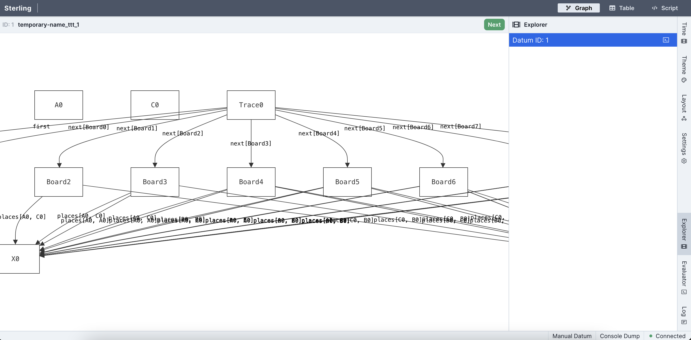
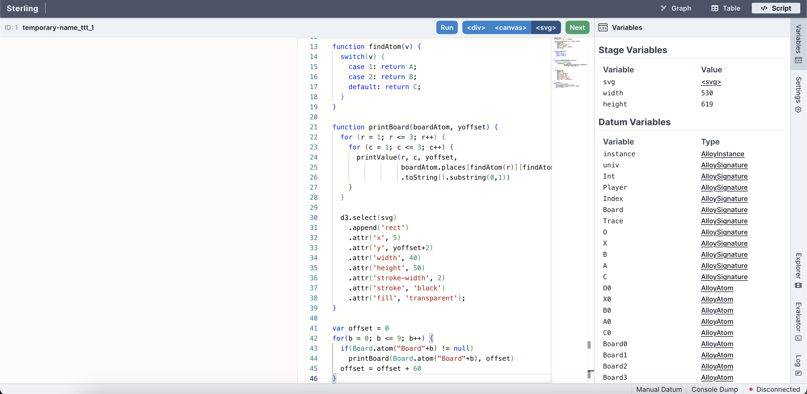

# Visualizing and Evaluating Output

Forge uses a modified version of the [Sterling](https://sterling-js.github.io/) model visualizer.

## Visualizing Output

When you execute your model, Forge will either look for instances that satisfy the predicates you wrote, or look for counterexamples to the assertion you wrote. If you used a `run` command, or if Forge found a counter-example to a `test`, `example`, or `assert` you wrote, Forge launches a window in your browser that displays the output. (See the run and check sections for the different displays Sterling has in various scenarios.)

The basic visualization of the model is a directed graph showing all the atoms in that instance and the relations between them. You can also view an alternate depiction of the instance in the table view tab. To keep visualizations neat, Sterling will not show you any `Int` atoms that are not used in the instance.

## Visualizing in Temporal Forge

In temporal mode, when the trace found is of length greater than 1, Sterling will enable a few new features:

- You can advance back and forth through the trace by using the arrow buttons in the `Time` drawer. Next to these buttons, Sterling will say which state the lasso loops back to. For instance, "Loop: 1" would mean that the lasso loops back to the second state (states are 0-indexed).
- Rather than one "Next" button, you'll see two: one labeled "Next" and the other "Next Config".
  - The "Next Config" button will ask the solver for a new trace that _varies the non-variable relations_ of your model. If all your relations are variable, or if other constraints prevent a different non-variable subset of the instance from satisfying your run, this button will lead to a no-more-instances screen.
  - The "Next" button will ask the solver for a new trace that _holds the non-variable relations constant_. If there are no other traces possible without changing the non-variable relations, this button will lead to a no-more-instances screen.

## The Evaluator

The evaluator provides a prompt that lets you query instances with Forge expressions. There are some minor differences between the evaluator language and Forge itself:

- Individual atoms can be directly referenced by name, like in `inst` blocks (remember to prefix them with a backquote!)
- Higher order quantification is allowed

Because the evaluator works with respect to a single instance, exact values of expressions are returned. These expressions are (as of January 2024) not always Forge syntax. E.g., relations are displayed using nested parentheses, and `false` is written as `#f`.
  

<!-- The evaluator can also be given commands like `--version` (`-v`) to show the version of Forge being used or `--help` (`-h`) to show the file being run. -->

## The Evaluator in Temporal Forge

If running in temporal mode, the evaluator is run in the context of the _first state_ of the trace shown. To ask about later traces, use the `'` or `next_state` operators. Remember that `next_state` applies to formulas, and `'` applies to relational expressions. So in a directed graph you could ask whether there are `edges` in the second state via `some edges'` or `after some edges`.

## Custom Visualizations: Script View

Sterling also allows you to write and run scripts that produce your own custom visualizations. This documentation site contains a basic example here:
- [example visualization script](../example-models/vis/ttt.js)
- [Tic-tac-toe model to run the script with](../example-models/ttt.frg)

If you want to try out this example, do the following:

**Step 1:** Open the Forge model and run it (`racket ttt.frg`). Sterling should open in your web browser, defaulting to the directed-graph visualization---which isn't very useful for this model. You should see something like this: 

**Step 2:** Click the Script button on the upper-right of the window. This will switch to custom script view mode. Paste the script into the editor, then click the `Run` button. You should see something like this before clicking `Run`:

~~~admonish hint title="Drawers"
If you don't like the "Variables" tab taking up space, just click the corresponding drawer on the far right. The tab should collapse, making more room for the editor and visualization area.
~~~

After running, you should see something like this, with a sequence of board states displayed on the left-hand side of the screen:

")

### More Information

For more complex examples, library documentation, instructions on writing your own visualizers, etc. see [Custom Visualizations](../sterling/custom-basics.md).
