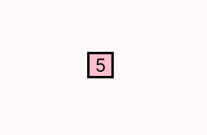
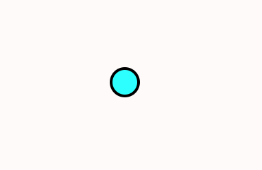
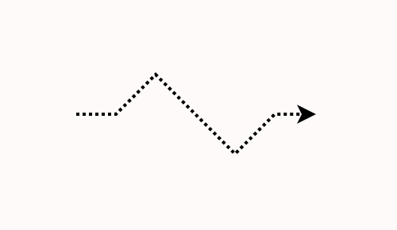
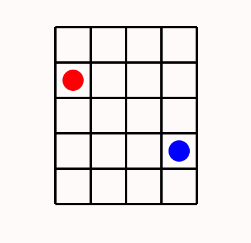
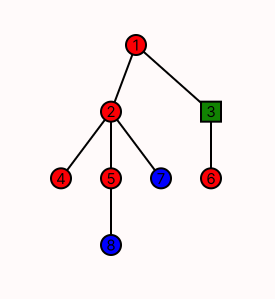
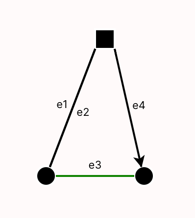

# D3FX Helpers

The D3FX helpers library was designed as an interface between Sterling users and the D3 visualization library in Javascript. D3 was originally the primary way that Forge users wrote custom visualizations. However, we have found that using D3 in Sterling can involve a large amount of learning and prep time--especially for those without much experience with JavaScript.

D3FX was created to ease writing custom visualizations in Sterling. It contains a library of shapes and objects that were commonly used in the past, such as grid layouts and labeled arrows. Since custom visualizations are still written in JavaScript, using D3FX requires some knowledge of the language, but its object-oriented design is meant to ease basic use for those who might be familiar with languages like Java or Python.

This page contains documentation for all classes in D3FX, along with small examples of how to create and work with them. Complete, runnable examples can be found in the Forge repository's [`viz-examples` directory](https://github.com/tnelson/Forge/tree/dev/viz-examples). 

~~~admonish warning name="Changes vs. February 2023"
There has been one major change in the library since the start of Spring 2023. Constructors now take a single object, rather than a varying number of parameters. This makes it easier to add new parameters without breaking existing code, and avoids confusion about how to order parameters. However, this required a one-time breaking change. 

If you've already written some visualizations this semester, converting should be easy. For example, our Dining Smiths lab visualization created a new text box with: 

```
new TextBox(`State:${idx}${lb}`,{x:0,y:0},'black',16)
``` 

This would need to be updated to :
```
new TextBox({text: `State:${idx}${lb}`, coords: {x:0,y:0}, color: 'black', fontSize: 16})
```
~~~

## Further Resources

In addition to this page, you can view supplementary examples in the Forge repository [here](https://github.com/tnelson/Forge/tree/dev/viz-examples). Each contains both a Forge model to run (`.frg`) and the corresponding script file (`.js`).

## The `Stage` and `VisualObjects`

Every element D3FX displays on the screen is represented by a `VisualObject`, which includes shapes like squares or circles, as well as more complicated objects like grids or trees.

To render visual objects, a `Stage` object needs to be created to contain them. After creating, the user can call `stage.add(...)` to place the visual object in the stage. To render all added `VisualObject`s, call `stage.render(...)`. Below is some important information for interacting with these objects, specifically for those without JavaScript experience.

~~~admonish note name="Calling stage.render"
Most commonly, `render` takes two parameters which are already defined in the script environment: `stage.render(svg, document)`. 
~~~

### Props and Optional Parameters

All `VisualObject`s will take in a _props_ (short for "properties") object. Props objects have a number of fields with designated types. These fields can be entered in any order with their corresponding names. For example:  
```
new Rectangle({
    height: 100,
    width: 200,
    coords: {x: 100, y: 50},
    color: 'red',
    label: 'Hello'
})
```
For ease of use, we've written out a template for each of these props objects in terms of an `interface`, like the following:
```
interface Coords {
    x: number,
    y: number
}
```

Fields in such interface declarations may include a `?`. This denotes that the field is _optional_.

~~~admonish warning name="Watch out: don't use types in your script code!"
While these definitions are useful tools, and these `interface` structures do exist in TypeScript (the language we wrote D3FX in), they **do not** exist in the raw JavaScript you'll use to write your visualizations! 

That said, instantiating a props object with `{field1: value, field2: value, ...}` will still be understood by the library as if JavaScript understood this wider interface system. Just don't include types, or try to reference the interfaces directly.
~~~

~~~admonish note name="Lambda Functions"
When implementing one of the classes listed later on, you may be prompted with a type hint of the form `text: string | () => string`. This means that the field `text` can take in either or a string, or an anonymous funtion that produces a string. For simple use, you can more or less ignore this distinction, and choose only to pass in a string. For ease of reading, any type of this form (`T | () => T`) has been collapsed to just `T` in all library documentation.
~~~

## Primitive Objects

A _primitive_ object is one that doesn't visually contain any other D3FX objects. 

### `TextBox`

Text boxes render text to the screen at a given location. Their constructor accepts a props object of the following form:
```
interface TextBoxProps {
    text? : string,
    coords?: Coords,
    color?: string,
    fontSize?: number
}
```

Here is an example `TextBox` using these props:

```
let text = new TextBox({
    text: 'hello',
    coords: {x: 50, y:50},
    color: 'black',
    fontSize: 12
}) 
```

~~~admonish note="Changing fields"
All parameters can be changed after initiation with corresponding setter methods. These methods are in the typical OO style of `setX(newValue: Type)`, and should be suggested by the text editor for ease of use. 
~~~

Additionally, `TextBox` supports script-defined callbacks. You can register _events_ using the `events` prop. Supported events are described [here](https://developer.mozilla.org/en-US/docs/Web/Events).

```admonish example title="TextBox with events"
~~~
new TextBox({
    text: 'hello',
    coords: {x: 50, y:50},
    color: 'black',
    fontSize: 12,
    events: [
        {event: 'click', callback: () => {console.log('clicked!')}}
    ]
}) 
~~~
```

### ImageBox 

An `ImageBox` contains an image loaded from a URL. 

```admonish example title="ImageBox"
~~~
const stage = new Stage()
const box = new ImageBox({
    coords: {x:100,y:100}, 
    url: "https://csci1710.github.io/2024/static/media/LFS_FROG.8de0a0795d10898e5fe9.png", 
    width:200, 
    height:200})
stage.add(box)
stage.render(svg)
~~~
```

### Primitive Shapes 

The primitive object types `Rectangle`, `Circle`, and `Polygon` are all instances of a wider class called `Shape`. As a result, their props objects all implement the following interface:
```
interface ShapeProps {
  color?: string,
  borderWidth?: number,
  borderColor?: string,
  label?: string,
  labelColor?: string,
  labelSize?: number,
  opacity?: number
}
```
For ease of reading, these fields will be rewritten later on where applicable.

#### `Rectangle`

Rectangles take in a pair of coordinates corresponding to the top left corner of the shape, along with a width and height. The props object is of the following form:
```
interface RectangleProps extends shape {
    height: number,
    width: number,
    labelLocation?: string,
    coords?: Coords,

    // Borrowed from shape
    color?: string,
    borderWidth?: number,
    borderColor?: string,
    label?: string,
    labelColor?: string,
    labelSize?: number,
    opacity?: number
}
```
The value of `label-location` can be `"center"` (default). Other options include `"topLeft"`, `"topRight"`, `"bottomLeft"`, and `"bottomRight"`, which will generate text outside the rectangle in these locations. 

Here is an example `Rectangle` using these props:
```
let rect = new Rectangle({
    coords: {x: 100, y:100},
    height: 20,
    width: 20,
    color: "pink",
    borderColor: "black",
    borderWidth: 2,
    label: "5"
})
```
Which renders the following:



#### `Circle`

Circles take in a pair of coordinates as the center and a radius, along with the rest of the following props object:
```
interface CircleProps extends ShapeProps {
    radius: number,

    // Borrowed from shape
    color?: string,
    borderWidth?: number,
    borderColor?: string,
    label?: string,
    labelColor?: string,
    labelSize?: number,
    opacity?: number
}
```
The text in the `label` will render in the center of the circle. Here is an example circle:
```
let circ = new Circle({
    radius: 10, 
    center: {x: 100, y:100}, 
    color: 'aqua', 
    borderWidth: 2, 
    borderColor: 'black', 
}); 
```
Which renders the following:



#### `Polygon`

Polygons are the most generic of the primitive shapes offered in D3FX. They take in any list of points and create a shape with those points on the perimeter. The props are of the form:
```
export interface PolygonProps extends ShapeProps {
    points: Coords[]

    // Borrowed from shape
    color?: string,
    borderWidth?: number,
    borderColor?: string,
    label?: string,
    labelColor?: string,
    labelSize?: number,
    opacity?: number
}
```
The label will be generated in roughly the center of the shape (the mean of the points entered). Here is an example of a polygon being used to create a (nonconvex) pentagon. 
```
polypoints = [
    {x:100, y:200},
    {x:200, y:200},
    {x:175, y:150},
    {x:200, y:100},
    {x:100, y:100}
]

let poly = new Polygon({
    points: polypoints, 
    color: 'orange', 
    borderWidth: 2, 
    borderColor: 'black', 
    label: "Hi!",
    labelColor: "black" ,
    opacity: 0.7
});
```
Which will render the following pentagon:


#### `Line`

A `Line` takes in a series of points and creates a line passing through said points. 
```
interface LineProps {
  points?: Coords[], 
  arrow?: boolean,
  color?: string, 
  width?: number,
  opacity?: number
  style?: string
}
```
If `arrow` is true, the end of the line will have a small arrowhead. Style can take the values of `'dotted'` or `'dashed'`Here's an example line:
```
polypoints = [
    {x:100, y:100},
    {x:125, y:100},
    {x:150, y:75},
    {x:200, y:125},
    {x:225, y:100},
    {x:250, y:100}
]

let line = new Line({
    points: polypoints, 
    color: 'black', 
    width: 2, 
    labelColor: "blue",
    arrow: true,
    style: "dotted"
});
```
Which will render:



## Compound Objects

While the above objects are good for simple visualizations, managing the relationship between many primitive objects manually can be difficult.  With this in mind, D3FX provides a number of _compound_ objects, which automatically group their child objects in a particular way. 

~~~admonish warning name="Don't add child objects to the stage"
Compound objects are responsible for rendering their children. If an object is a child of another object, don't `add` it to the stage as well. If you do so, there may be unexpected consequences when rendering, since the child object would then be rendered twice in two different contexts.

In other words, avoid code like the following:

```
circ = new Circle({...})
comp = new SomeCompoundObject({innerObject: circ, ...}) // circ is a child object

stage.add(comp) // the stage will render comp, which then renders its child circ
stage.add(circ) // the stage will render circ (again)
```
~~~

### `Grid`

Grids place visual objects into a 2-dimensional arrangement of cells. The grid constructor takes in the following props:
```
interface gridProps {
    grid_location: Coords, // Top left corner
    cell_size:{
        x_size:number,
        y_size:number
    },
    grid_dimensions:{
        x_size:number,
        y_size:number
    },
}
```
The `grid_dimensions` field should be a pair of positive integers, referring to the horizontal and vertical capacity of the array, respectively. The `cell_size`, in pixels, will be the size allocated for each of these objects in the rendered grid. Grids also offer the `add` method to fill these cells with `VisualObject`s:
```
add(
    coords: Coords, 
    add_object:VisualObject, 
    ignore_warning?:boolean
)
``` 
The coordinates should be integers designating which row and column of the grid to add the child object to. Notably, _the child object's visual location will immediately be adjusted to fit the cell._

Adding a child object will produce an error if the child object does not fit into the given cell. To ignore this error, set the `ignore_warning` prop to true. 

Here is an example of a simple grid:

```
let grid = new Grid({
    grid_location: {x: 50, y:50},
    cell_size: {x_size: 30, y_size: 30},
    grid_dimensions: {x_size: 4, y_size: 5}
})

grid.add({x: 0, y: 1}, new Circle({radius: 10, color: "red"}))
grid.add({x: 3, y: 3}, new Circle({radius: 10, color: "blue"}))
```
Here we have a 4x4 grid of 30x30 pixel squares, into two of which we place circles. Note that the circles added to the grid do not have coordinates. This is because the coordinates of these shapes are immediately changed to be in the center of the given squares in the grid. This renders as follows:



### `Tree`

The `Tree` object renders a branching data structure. While in principle Sterling's default visualization can produce trees, the `Tree` object in D3FX allows a finer degree of control. 

The nodes in a `Tree` object are themselves visual objects, which will then automatically be rendered with lines between them. The props for `Tree` are as follows:
```
interface TreeProps {
    root: VisTree, 
    height: number, 
    width: number, 
    coords?: Coords, 
    edgeColor?: string, 
    edgeWidth?: number
}
```
Where the `VisTree` interface logically represents a tree and its subtrees in recursive fashion:
```
interface VisTree{
    visualObject: VisualObject,
    children: VisTree[]
}
```
When rendered, the tree will be adjusted to exactly fit into the box with top-left corner designated by `coords` and dimensions designated by `height` and `width`. Here is an example tree with four layers:
```
let obj1 = new Circle({radius: 10, color: 'red', borderColor: "black", label: '1'});
let obj2 = new Circle({radius: 10, color: 'red', borderColor: "black", label: '2'});
let obj3 = new Rectangle({height: 20, width: 20, color: 'green', borderColor: "black", label: '3'});
let obj4 = new Circle({radius: 10, color: 'red', borderColor: "black", label: '4'});
let obj5 = new Circle({radius: 10, color: 'red', borderColor: "black", label: '5'});
let obj6 = new Circle({radius: 10, color: 'red', borderColor: "black", label: '6'});
let obj7 = new Circle({radius: 10, color: 'blue', borderColor: "black", label: '7'});
let obj8 = new Circle({radius: 10, color: 'blue', borderColor: "black", label: '8'});

let visTree = {
  visualObject: obj1,
  children: [
    {
      visualObject: obj2,
      children: [
        { visualObject: obj4, children: [] },
        {
          visualObject: obj5,
          children: [{ visualObject: obj8, children: [] }]
        },
        { visualObject: obj7, children: [] }
      ]
    },
    {
      visualObject: obj3,
      children: [{ visualObject: obj6, children: [] }]
    }
  ]
};

let tree = new Tree({
    root: visTree, 
    height: 200, 
    width: 200, 
    coords: { x: 100, y: 100 }
    });
```
which renders as:



### `Edge`

Edges display relationships between objects, without requiring manual management of those objects' locations---unlike the primitive `Line`. Edge objects take in the following props:
```
export interface EdgeProps {
  obj1: VisualObject;
  obj2: VisualObject;
  lineProps: LineProps;
  textProps: TextBoxProps;
  textLocation: string;
}
```
Here, `obj1` represents the first visual object, or the source of the edge, and `obj2` is the sink. Styling, color, width, and more attributes of the edge itself can be designated in `lineProps`, which contains all the information that would normally be passed to a `Line`.  Similarly, the label for the line is designated by `textProps`, which supports all relevant features used in the label's underlying `TextBox` object.

~~~admonish warning name="Edges do not render the objects they reference"
Unlike with other compound objects, `Edge` _does not_ render its children. This is because each object should only be rendered once, but an object might be referenced by multiple edges, such as in visualizing a graph. 

Thus, the objects that an edge spans must still be added to the stage, or to some other appropriate and unique container.
~~~

Lastly, `textLocation` allows for freedom in determining the location of the label. By default, the label will appear in the exact center of the line. However, passing in `right`, `left`, `above`, or `below` will offset the location by whatever orthogonal direction closest to the input. There is also support for `clockwise` or `counterclockwise`, which place the label in the stated location from the perspective of the source object. Here is an example of a few edges between visualObjects:

```
const rect = new Rectangle({width: 20, height: 20, coords: {x:200, y:50}})
const circ1 = new Circle({radius: 10, center: {x:150, y:200}})
const circ2 = new Circle({radius: 10, center: {x:250, y:200}})

const edge1 = new Edge({
    obj1: rect, obj2: circ1,
    textProps: {text: "e1", fontSize: 11},
    textLocation: "above"
})
const edge2 = new Edge({obj1: circ1, obj2: rect,
    textProps: {text: "e2", fontSize: 11},
    textLocation: "below"})
const edge3 = new Edge({obj1: circ1, obj2: circ2,
    textProps: {text: "e3", fontSize: 11},
    lineProps: {color: "green"},
    textLocation: "above"})
const edge4 = new Edge({obj1: rect, obj2: circ2,
    lineProps: {arrow: true},
    textProps: {text: "e4", fontSize: 11},
    textLocation: "above"})

// Adding all objects and circles to the stage individually before rendering. 
```

This renders as:

